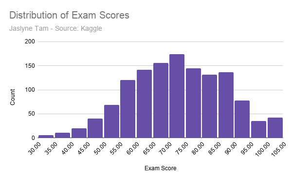
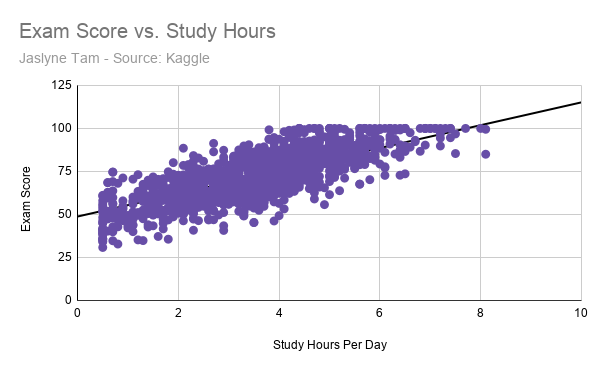
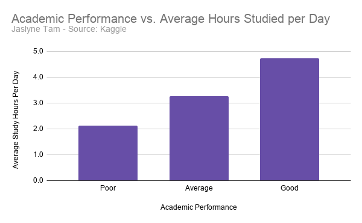

# How Study Habits, Sleep, and Stress Relate to Academic Performance

This dataset came from an open-source archive on Kaggle. It focuses on student lifestyle measured against their academic performance and includes information on students' study habits, attendance, sleep patterns, social media usage, and academic performance in both numerical and categorical form.

As Kaggle is an open repository for anyone to upload data, the source of the data is not completely trustworthy. The author, Shyam Nadh S, noted that the data set's intended purpose was to give data science beginners practice in "Exploratory Data Analysis (EDA), data cleaning, feature engineering, and basic machine learning." The dataset description does not explain how the information was originally collected, which schools or regions the students came from, how large or representative the sample is, or whether the data was gathered through surveys, institutional records, or another method. Without this information, it is difficult to verify the accuracy or representativeness of the data.

Since the dataset was created primarily for educational purposes rather than academic research or official reporting, it should be treated with a grain of salt. journalist would need to independently verify the data before drawing conclusions or publishing findings. Additional information about the sampling methods, data collection process, and potential biases would be necessary to determine whether the observed relationships reflect broader student populations or only this specific dataset.

## Data Analysis 

To comb through my data, I first created filters to sort out any empty values and delete null data. Afterwards, I played around with pivot tables to identify interesting trends or relationships. 

1. I first looked at the relationship between gender and academic performance factors (CGPA, Exam Score, Study Hours per Day). I created averages for the performance factors and compared them against the gender category; ultimately, the difference between genders was negligible, with only a decimal point of difference between Female and Male.

2. I then looked at the relationship between the academic performance rating given in the dataset (split between Poor, Average, and Good) and similar academic performance factors, including average attendance. Here, the relationship was more cogent, as all of the academic performance factors increased as the performance rating improved. For example, the average CGPA for students with a "Poor" academic performance rating was 1.9 on a 4.0 scale, while students with a "Good" rating had an average CGPA of 3.6. Factors such as attendance and study hours likely influenced this, as students with a "Poor" rating had an average attendance of 79.4% and studied for an average of 2.1 hours a day, as compared to those with a "Good" rating, whose average attendance was 83.7% and studied for an average of 4.7 hours a day.

3. I also wanted to see how stress level impacted other lifestyle and academic aspects, namely average hours of sleep and average exam score. Stress level was split into 3 categories (Low, Medium, High), and I created a pivot table to compare stress against the aforementioned factors. Here, I found that while the difference was minute, there did seem to be a slight relationship between stress level and these factors. Students with a "Low" stress level averaged 7.05 hours of sleep and scored an exam score average of 72.29. On the other hand, students with a "High" stress level averaged 6.75 hours of sleep a night. Intriguingly enough, however, students with "High" stress performed most poorly in exams, with an exam score average of 71.78. This could highlight a potential relationship between sleep levels and exam scores, or perhaps the negative impact of stress on academic performance.

## Data Visualizations 

1. Distribution of Exam Scores

In order to gauge the overall academic performance of this set of students, I wanted to visualize the distribution of their exam scores, and see if there were any clusters around certain ranges. Overall, the distribution seemed to be roughly normally distributed.

2. Exam Scores vs. Study Hours

I wanted to see if there was a relationship between time spent studying and exam results, as it would logically have a positive correlation. Overall, there seems to be a positive trend toward a higher exam score based on the hours spent studying a day with minimal outliers. 

3. Academic Performance vs. Study Hours

I hoped to better understand how the academic performance rating was categorized through this visualization, while also seeing how else study hours might have an impact. A similar trend occurs here as in the previous chart, as the more hours spent studying in a day seems to correlate with a higher academic performance. 

## Ending summary, ethical concerns, reporting process

This project explored the relationship between student lifestyle factors, such as study habits, sleep, attendance, stress, and screen time, and academic performance. While my data analysis and visualizations suggested several trends between lifestyle factors and academic performance, these findings should be interpreted as correlations rather than evidence of cause and effect.

In terms of ethical considerations, as the original source of the data and its collection methods are unknown, the results could unintentionally misrepresent or stigmatize certain groups of students. There are numerous confounding factors that could impact academic performance beyond those measured in this data set; for example, lower attendance rates could be a result of factors such as financial hardship, mental health, family responsibilities, disabilities, or unequal access to educational resources. Without demographic or contextual information, these findings aren't generally applicable across the general population.

To produce a complete and ethical story, additional reporting would be necessary. The data collection methods must be verified, and more qualitative data could help to provide important context, such as interviews with educators and students. Furthermore, comparing these findings with data from schools or government education agencies could help to provide more real-world evidence to back up any findings, and that are more applicable across different demographics. By including multiple sources and perspectives, the story would be more accurate, balanced, and would avoid oversimplifying the complex factors that influence academic success.
